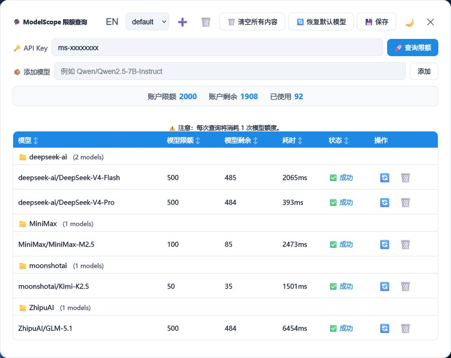
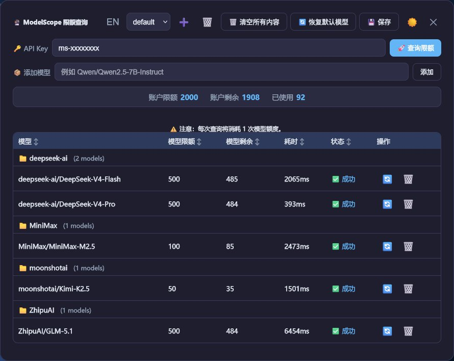

# ModelScope Rate Limit Check (魔搭社区限额查询)

一个用户脚本（Userscript），用于批量查询 [ModelScope](https://modelscope.cn) API 的用量与配额，支持多 API Key 管理、模型分组、深色模式和中英双语。

## ✨ 功能特性

- 🔑 **多 API Key 管理与切换**：可为不同的 Key 独立保存模型列表和查询结果。
- 📊 **账户 + 模型双维度配额**：一次查询同时获取账户级限额、剩余和模型级限额、剩余。
- 📦 **灵活的模型列表**：内置常用模型，支持手动添加、删除，输入历史自动补全。
- 🗂️ **按提供商自动分组**：模型按 `provider/model` 分组，可折叠/展开。
- 🌙 **深色 / 浅色模式**：一键切换，自动保存偏好。
- 🌍 **中英双语界面**：中文 / English 随时切换。
- ⚡ **批量查询 + 单模型刷新**：支持全部模型一起查，也能单独刷新某个模型。
- 📋 **一键复制模型名**：点击表格中的模型名称即可复制到剪贴板。
- 💾 **持久化存储**：API Key、模型列表、查询结果、输入历史均通过 Tampermonkey 存储。
- 📈 **账户概览条**：实时显示账户总配额、剩余、已使用。
- ⚠️ **贴心提醒**：界面上明确提示每次查询会消耗 1 次模型请求。

## 📥 安装方法

1. 安装一个用户脚本管理器扩展：
   - [Tampermonkey](https://www.tampermonkey.net/)（推荐）
2. 点击下方链接安装脚本（需要先安装上述扩展）：
   - **主安装链接**：[点击安装](https://raw.githubusercontent.com/RUnknown/modelscope-ratelimit-check/main/ModelScope-Ratelimit-Check.user.js)
   - **镜像源安装**：[点击安装](https://fastly.jsdelivr.net/gh/RUnknown/modelscope-ratelimit-check@main/ModelScope-Ratelimit-Check.user.js)
   > 你也可以直接打开仓库中的 `.user.js` 文件，Tampermonkey 通常会自动弹出安装提示。
3. 安装完成后，刷新任意页面，在 Tampermonkey 扩展的菜单中找到 **「ModelScope 限额查询」** 即可打开控制面板。

## 🚀 使用指南

### 1. 获取 API Key
- 访问 [ModelScope 账户设置 → 访问控制 → 访问令牌](https://modelscope.cn/my/access/token) 获取 API Key（通常以 `ms-` 开头）。
- 注意：需要使用 `api-inference` 相关的可用 Key。

### 2. 打开控制面板
- 通过 Tampermonkey 菜单点击 **「ModelScope 限额查询」**，会在当前页面中央弹出面板。

### 3. 输入 Key 并查询
- 在 **🔑 API Key** 输入框中粘贴你的 Key，支持历史输入补全。
- 下方 **📦 添加模型** 可临时添加新模型，或点击 **🔄 恢复默认模型** 使用预置列表。
- 点击 **🚀 查询限额**，脚本将依次对每个模型发送一个微小的请求（`max_tokens=1`），并从响应头中提取限额信息。

### 4. 查看结果
- 查询完成后，表格会展示每个模型的 **模型限额**、**模型剩余**、**查询耗时** 和状态。
- 顶部 **账户概览** 栏会显示当前账户的总限额、剩余及已使用量。
- 模型名称可点击复制，方便分享。
- 表格行按模型提供商分组，点击分组行可以折叠/展开该组模型。

### 5. 管理多个 Key
- 面板上方可通过下拉框切换已保存的 Key。
- 使用 **➕** 按钮添加新 Key，**🗑️** 删除当前 Key。
- 每个 Key 的模型列表和查询结果独立保存，互不干扰。

## ⚙️ 面板按钮说明

| 按钮 / 控件 | 功能 |
|------------|------|
| **EN / 中文** | 切换界面语言 |
| **下拉框 (Key 名称)** | 选择当前使用的 API Key |
| **➕** | 添加一个新的 Key（需输入名称） |
| **🗑️** | 删除当前 Key |
| **🗑️ 清空所有内容** | 清空当前 Key 的 API Key、模型列表和结果 |
| **🔄 恢复默认模型** | 将当前 Key 的模型列表重置为内置默认模型 |
| **💾 保存** | 手动保存当前配置（结果通常自动保存） |
| **🌙 / ☀️** | 切换深色 / 浅色模式 |
| **✕** | 关闭面板 |
| **表格 🔄 按钮** | 单独刷新该行的模型 |
| **表格 🗑️ 按钮** | 从列表删除该模型 |

## 🧠 工作原理

脚本通过向 ModelScope 推理 API 发送一个极小的聊天补全请求：

```
POST https://api-inference.modelscope.cn/v1/chat/completions
{
    "model": "deepseek-ai/DeepSeek-V4-Flash",
    "messages": [{"role": "user", "content": "hi"}],
    "max_tokens": 1
}
```

并从 **HTTP 响应头** 中提取以下字段：

- `modelscope-ratelimit-requests-limit`      → 账户总请求限额
- `modelscope-ratelimit-requests-remaining`  → 账户剩余请求数
- `modelscope-ratelimit-model-requests-limit`    → 该模型总限额
- `modelscope-ratelimit-model-requests-remaining` → 该模型剩余配额

> ⚠️ **重要提示**：每次查询都会真实消耗 **1 次 API 调用**，请合理规划查询频率。

## 🔧 技术实现

- 纯前端脚本，基于 [Tampermonkey API](https://www.tampermonkey.net/documentation.php) (`GM_xmlhttpRequest`, `GM_setValue`, `GM_getValue`, `GM_registerMenuCommand`)
- 所有数据存储在浏览器本地（Tampermonkey 存储区），不上传任何服务器
- 使用原生 JavaScript 构建 UI，无外部依赖
- 支持所有遵循 W3C 标准的现代浏览器（Chrome / Edge / Firefox）

## 📸 预览截图

|               浅色模式                     |                    深色模式                  |
| :---------------------------------------: | :------------------------------------------: |
|  |  |

## 🤝 贡献

欢迎提交 Issue、Feature Request 或 Pull Request 来完善这个脚本。

---

**特别感谢**
本脚本的灵感与参考项目：
- [modelscope-quota](https://github.com/898103574/modelscope-quota)
- [ModelScopeApiBalanceCheck](https://github.com/Morningstars666/ModelScopeApiBalanceCheck)
